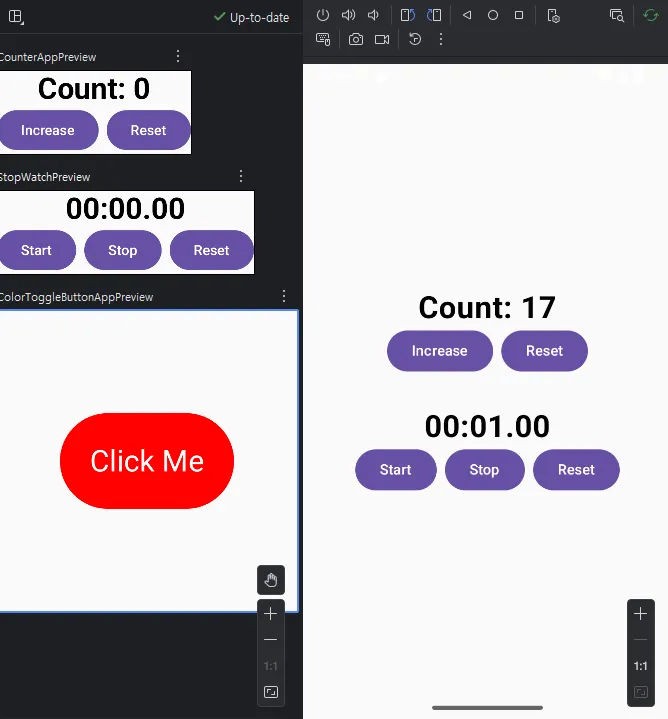

# mobile-app

## 이란우의 모바일 앱 수업

모바일 앱 실습
Space
<table border="0" cellpadding="0" cellspacing="15" align="center">
 
  <tr>
    <td align="center" valign="top">
      <table border="1" cellpadding="5" cellspacing="0">
        <tr><td align="center" valign="middle"></td></tr>
      </table>
    </td>
    <td align="center" valign="top">
      <table border="1" cellpadding="5" cellspacing="0">
        <tr><td align="center" valign="middle"></td></tr>
      </table>
    </td>
    <td align="center" valign="top">
      <table border="1" cellpadding="5" cellspacing="0">
        <tr><td align="center" valign="middle"></td></tr>
      </table>
    </td>
    <td align="center" valign="top">
      <table border="1" cellpadding="5" cellspacing="0">
        <tr><td align="center" valign="middle"></td></tr>
      </table>
    </td>
  </tr>
 
  <tr>
    <td align="center" valign="top">
      <table border="1" cellpadding="5" cellspacing="0">
        <tr><td align="center" valign="top" width="150" height="90">
          <strong>엑시노스 칩 소개</strong> 
          간단한 소개 화면입니다.
        </td></tr>
      </table>
    </td>
    <td align="center" valign="top">
      <table border="1" cellpadding="5" cellspacing="0">
        <tr><td align="center" valign="top" width="150" height="90">
          <strong>전화 다이얼 앱</strong> 
          Jetpack Compose로 만든 다이얼 UI
        </td></tr>
      </table>
    </td>
    <td align="center" valign="top">
      <table border="1" cellpadding="5" cellspacing="0">
        <tr><td align="center" valign="top" width="150" height="90">
          <strong>스톱워치</strong> 
          시간 및 랩 타임 측정 기능
        </td></tr>
      </table>
    </td>
    <td align="center" valign="top">
      <table border="1" cellpadding="5" cellspacing="0">
        <tr><td align="center" valign="top" width="150" height="90">
          <strong>미니 게임</strong> 
          간단한 버블 게임 화면
        </td></tr>
      </table>
S   </td>
  </tr>
  
  <tr>
    <td align="center" valign="top">
      <table border="1" cellpadding="5" cellspacing="0">
        <tr><td align="center" valign="middle"></td></tr>
      </table>
    </td>
    <td align="center" valign="top">
      <table border="1" cellpadding="5" cellspacing="0">
        <tr><td align="center" valign="middle"></td></tr>
      </table>
    </td>
    <td align="center" valign="top">
      <table border="1" cellpadding="5" cellspacing="0">
        <tr><td align="center" valign="middle"></td></tr>
      </table>
    </td>
    <td align="center" valign="top">
      <table border="1" cellpadding="5" cellspacing="0">
        <tr><td align="center" valign="middle"></td></tr>
      </table>
    </td>
  </tr>
 
  <tr>
    <td align="center" valign="top">
      <table border="1" cellpadding="5" cellspacing="0">
        <tr><td align="center" valign="top" width="150" height="90">
          <strong>엑시노스 칩 소개</strong> 
          간단한 소개 화면입니다.
        </td></tr>
      </table>
    </td>
    <td align="center" valign="top">
      <table border="1" cellpadding="5" cellspacing="0">
        <tr><td align="center" valign="top" width="150" height="90">
          <strong>전화 다이얼 앱</strong> 
          Jetpack Compose로 만든 다이얼 UI
        </td></tr>
      </table>
    </td>
    <td align="center" valign="top">
      <table border="1" cellpadding="5" cellspacing="0">
        <tr><td align="center" valign="top" width="150" height="90">
          <strong>스톱워치</strong> 
          시간 및 랩 타임 측정 기능
        </td></tr>
      </table>
    </td>
    <td align="center" valign="top">
S     <table border="1" cellpadding="5" cellspacing="0">
        <tr><td align="center" valign="top" width="150" height="90">
          <strong>미니 게임</strong> 
          간단한 버블 게임 화면
        </td></tr>
      </table>
    </td>
  </tr>

</table>
